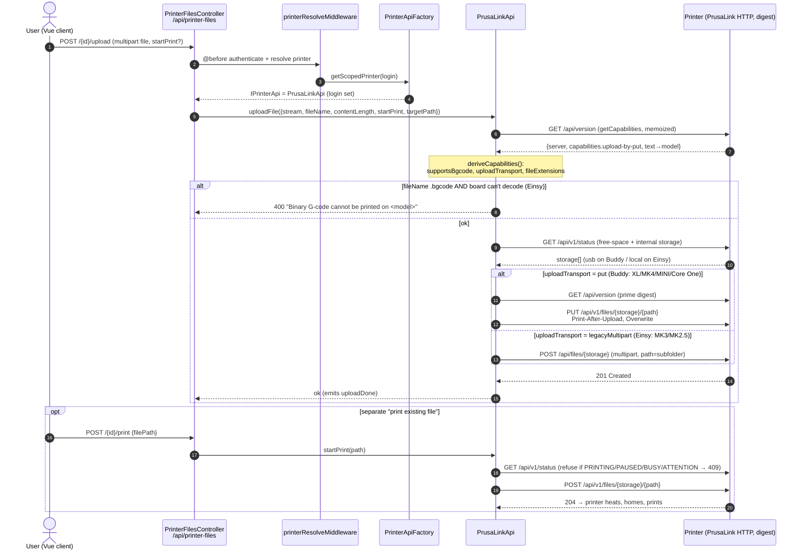
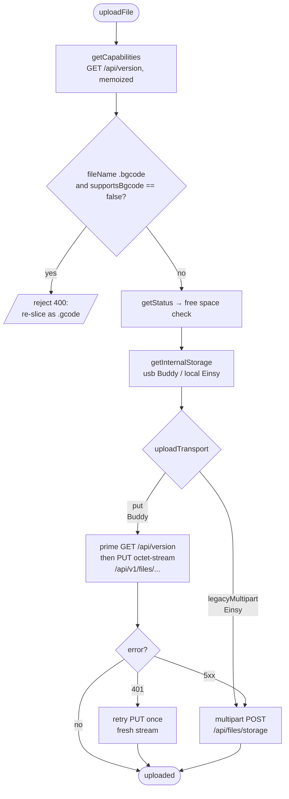
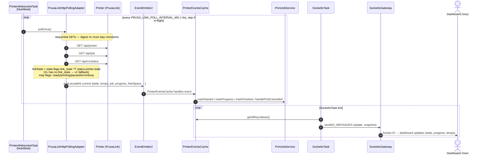

# Printing a file — end-to-end flow (PrusaLink)

How a file goes from the browser to a running print, and how live state gets
back to the dashboard. Names map to real code: `PrinterFilesController`
(`src/controllers/printer-files.controller.ts`), `PrinterApiFactory`
(`src/services/printer-api.factory.ts`), `PrusaLinkApi`
(`src/services/prusa-link/prusa-link.api.ts`), `PrusaLinkHttpPollingAdapter`,
`PrinterEventsCache`, `SocketIoTask`, `SocketIoGateway`.

## 1. Upload & start print (request path)

## 2. Firmware decisions inside `uploadFile` (the capability profile)

`deriveCapabilities(/api/version)` centralises the firmware divergences
(mirrors how upstream Prusa-Link-Web ships a per-variant flag set, but resolved
at runtime). See `src/services/prusa-link/utils/prusa-link-capabilities.ts`.

## 3. Live state back to the dashboard (continuous, parallel)

Independent of any single request: a recurring poll feeds an in-memory cache,
which a second task pushes to clients over Socket.IO.

## Notes / firmware gotchas (hardware-verified)

- **XL prints `.bgcode` only**; legacy Einsy (MK3) prints `.gcode` only — gated by `supportsBgcode`.
- **Upload transport differs**: Buddy accepts the modern `PUT`; the Einsy shim advertises `upload-by-put` but 500s on it, so it must use the legacy multipart `POST`.
- **Delete returns `409` when the file is in use** — including when it's *open in the Buddy print preview* (selected). Not visible in status/job; the adapter surfaces an actionable message (`throwDeleteError`).
- **`link_state` is Einsy-only**; the XL carries live state on `/api/v1/status.printer.state` (the polling adapter falls back to it).
- **MK3 listings are ~1s eventually consistent**; the XL is immediate.
